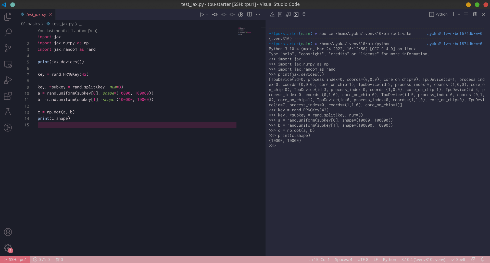

# TPU Starter

Everything you want to know about Google Cloud TPUs

**Note**: This is a TPU introduction article in progress. It will be expand and revised in the near future.

## 1. Introduction

### 1.1. Why do you need TPU?

**TL;DR: TPU is to GPU as GPU is to CPU**

TPU is a special hardware designed specifically for machine learning. Therefore, machine learning (including deep learning) programs run much faster on TPU.

### 1.2. When do you not need a TPU?

There are some known issues and drawbacks with TPU.

1. TPU is poorly supported by PyTorch. In one of my experiments, one batch took about 14 seconds to run on CPU, but over 4 hours to run on TPU. Twitter user @mauricetpunkt also thinks [PyTorch's performance on TPUs is bad](https://twitter.com/mauricetpunkt/status/1506944350281945090).
2. One single TPU v3-8 device has 8 cores (16 GiB memory for each core), but you need to write extra code to make use of all the 8 cores (see [named axes and easy-to-revise parallelism](https://jax.readthedocs.io/en/latest/notebooks/xmap_tutorial.html) in the JAX documentation). Otherwise, only the first core is used.

### 1.3. TPU is good. Can I touch a real TPU?

Unfortunately, in most cases you cannot touch a TPU physically because it is only available through cloud services. You can use TPU through [Google Colab](https://colab.research.google.com/) (this is how most people get to know it, but I recommend the next one) and [Google Cloud Platform](https://cloud.google.com/tpu).

### 1.4. How do I get access to TPU?

I recommend using [Google Cloud Platform](https://cloud.google.com/tpu).

After creating an account, navigate to the [TPU management page](https://console.cloud.google.com/compute/tpus), and you can create TPU instances on the page.

Remember to select 'TPU VM' for the architecture when creating a TPU instance (see below).


### 1.5. What does it mean to create a TPU instance? What do I actually get?

After creating a TPU v3-8 instance on Google Cloud Platform, you will get a Ubuntu 20.04 cloud server with 96 cores, 335 GiB memory and one TPU device with 8 cores (128 GiB TPU memory in total).

This is very similar to the way we use GPU. In most cases, when you use a GPU, you use a Linux server that connects with a GPU. When you use a TPU, you use a Linux server that connects with a TPU.

TODO: Add a htop image here.

### 1.6. To what extent can I control the server and TPU?

You have sudo privileges of the TPU VM. So after SSH into the server, you can do everything with the server and the TPU.

For example, you can open a Python REPL and do some computation without TPU:



You can also do some simple arithmetic on TPU:


P.S.: If you do floating point calculations directly on TPU, the result may be wrong. See [google/jax#9973](https://github.com/google/jax/issues/9973).

### 1.7. How much does it cost to use TPU on the Google Cloud Platform?

You will have free access to TPU for 30 days if you apply for the [TPU Research Cloud](https://sites.research.google/trc/about/) program. You can find more details about the project on the TRC homepage. I will not introduce the awesome TRC project in detail, because Shawn has written a wonderful article in [google/jax#2108](https://github.com/google/jax/issues/2108#issuecomment-866238579). Anyone who is interested in TPU should read it immediately.

### 1.8. TODO

Introduction to Cloud TPUs

(coming soon)

- Cloud TPU machine: TPU VM, TPU Node (deprecated), Colab TPU (different)
- Deep learning libraries: [Tensorflow](Tensorflow) (officially supported by Google), [PyTorch](https://pytorch.org/) (supports TPU via PyTorch XLA), [JAX](https://github.com/google/jax) (latest and most suitable for TPU)
- Linear algebra libraries: [NumPy](https://numpy.org/) (CPU only), [JAX](https://github.com/google/jax) (cross-platform)
- JAX ecosystem: [JAX](https://github.com/google/jax) (basis), [Flax](https://github.com/google/flax) (neural network), [DM Haiku](https://github.com/deepmind/dm-haiku) (neural network), [Optax](https://github.com/deepmind/optax) (optimizer)

## 2. Environment Setup

### 2.1. Create a TPU instance

Create a Cloud TPU VM v3-8 with TPU software version v2-nightly20210914.

TODO: Add screenshoots of creating a TPU VM instance.

### 2.2. Basic configurations

Before you can SSH into the Cloud VM, you need to login by the `gcloud` command:

```sh
gcloud alpha compute tpus tpu-vm ssh node-1 --zone europe-west4-a
```

After logging in, you can add your public key to `~/.ssh/authorized_keys`.

Install packages:

```sh
sudo apt update
sudo apt upgrade
sudo apt install -y python-is-python3 python3.8-venv mosh byobu
sudo reboot
```

Install Python 3.10:

```sh
sudo apt install software-properties-common -y
sudo add-apt-repository ppa:deadsnakes/ppa
sudo apt install python3.10 python3.10-distutils python3.10-dev
curl -sS https://bootstrap.pypa.io/get-pip.py | sudo python3.10
python3.10 -m pip install venv
python3.10 -m venv ~/venv310
. ~/venv310/bin/activate
```

Install JAX with TPU support:

```sh
pip install -U pip
pip install -U wheel
pip install "jax[tpu]==0.3.4" -f https://storage.googleapis.com/jax-releases/libtpu_releases.html
```

Install common packages and libraries:

```sh
pip install -r requirements.txt
```

TODO: Add more tools like oh-my-zsh, mosh, byobu, VSCode Remote-SSH, rsync.

### 2.3. How can I verify that the TPU is working?

Run:

```python
import jax
import jax.numpy as np
import jax.random as rand

print(jax.devices())  # should print TPU

key = rand.PRNGKey(42)

key, *subkey = rand.split(key, num=3)
a = rand.uniform(subkey[0], shape=(10000, 100000))
b = rand.uniform(subkey[1], shape=(100000, 10000))

c = np.dot(a, b)
print(c.shape)
```

## 6. More Resources about TPU

- Product page: https://cloud.google.com/tpu
- Documentation: https://cloud.google.com/tpu/docs
- TPU Research Cloud: https://sites.research.google/trc/about/
- Hugging Face Accelerate: https://github.com/huggingface/accelerate
- https://github.com/shawwn/jaxnotes/blob/master/notebooks/001_jax.ipynb

Community: As of 23 Feb, 2022, there is no official chat group for Cloud TPUs. You can join our unofficial chat group [@cloudtpu](https://t.me/cloudtpu) on Telegram.
